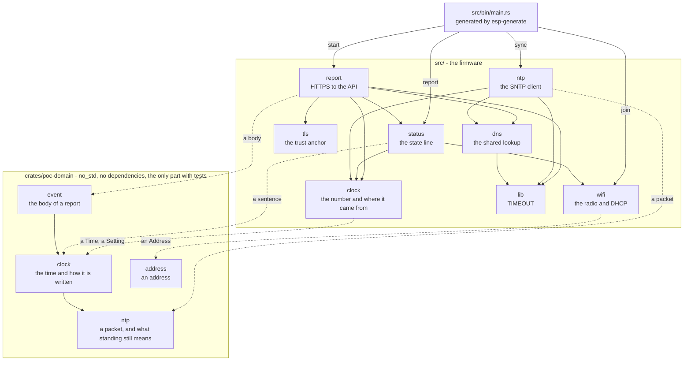

# esp-poc

Firmware proof of concept for the Espressif **ESP32-C3** and **ESP32-C6**, in bare-metal Rust:
`#![no_std]`, `#![no_main]`, no `std`. One branch builds for both: the chip is a Cargo feature, so
`cargo build` produces one and a feature flag produces the other. The project was generated by
[esp-generate](https://github.com/esp-rs/esp-generate) and everything added since is the
[quality gate](CONTRIBUTING.md#the-gate) and the tooling around it, plus the proof of concept.

## What it does right now

Bring up the HAL at maximum CPU clock, take the pins the module reserves so they cannot be used by
accident, then join a Wi-Fi network, print the address DHCP hands out, and set the clock from an
SNTP server over that network — and every 500 ms print one line that says all of it:

```text
Hello world! 2026-10-04T18:22:31Z (from a stratum 2 server), 192.168.0.225/24, wifi: joined
```

It reads as the time and where it came from, then the address, then the state of the radio — the
last because it is what a reader looks for when one of the first two is wrong. The line is one
`Status` in [`src/status.rs`](src/status.rs), assembled from three answers that three tasks each
produce, and its order is a decision stated once in that file rather than worked out next to the
printer.

It also says when something is wrong, and what:

| What the line says                                                         | What it means                                                  |
| -------------------------------------------------------------------------- | -------------------------------------------------------------- |
| `00:00:42 (counting from boot: nothing has answered yet)`                  | no server has answered yet                                     |
| `00:01:03 (counting from boot: the time server's answer did not arrive)`   | the last attempt, and the step of it that failed               |
| `2026-10-04T18:22:31Z (from a stratum 2 server, last confirmed 3900s ago)` | a real time, from a server, and nobody has confirmed it since  |
| `wifi: joined`                                                             | the station is on the network                                  |
| `wifi: joining`                                                            | an attempt is in progress or due                               |
| `wifi: not joined: NoAccessPointFound (signal -81 dBm)`                    | the last failure, in the driver's own words, with the signal   |
| `wifi: not joined: FourWayHandshakeTimeout (signal -55 dBm)`               | the radio ran out of time mid-handshake and did not say why    |
| `wifi: nothing to join: no credentials were compiled in`                   | a build with no `WIFI_SSID`, which is what the gate and CI are |

The time is UTC, and it is only real once a server has answered. This chip has no battery-backed
clock, so before that the greeting prints how long it has been running since boot, wrapped into a
day, and the difference is visible in the shape: a bare `HH:MM:SS` counts from boot, and an RFC 3339
timestamp came from a server. Between two answers the clock keeps moving on its own crystal, so a
reading nobody has confirmed for an hour says how long ago that was in seconds. The time lives in
RAM, so every boot asks again. `src/ntp.rs` is the client; `src/clock.rs` is the one number it sets
and the three facts about where it came from.

Wi-Fi is [`esp-radio`](https://docs.espressif.com/projects/rust/esp-radio/latest/), which on both
chips is part of the chip itself: there are no pins to choose and no antenna to configure. It needs
a preemptive scheduler (`esp-rtos`) and a heap, which is why the firmware is no longer heap-free,
and the TCP/IP stack that turns a joined network into an address (`embassy-net`). `src/wifi.rs` has
the whole sequence up to the network and publishes what the radio is doing; `src/ntp.rs` and
`src/clock.rs` are what the network is for; `src/status.rs` is the one place that asks all three and
puts the answers together; `src/report.rs` sends that line to an HTTPS API every five minutes and
`src/tls.rs` is what makes the API's answer to it trustworthy; `src/bin/main.rs` is the entry point
that starts them and prints the result.

### Reporting to an API

Once the network is up, the firmware sends that same state line to an HTTPS endpoint every five
minutes. It says which one before anything else, because the host comes from the environment and a
reader of a serial log cannot see an environment:

```text
[INFO ] reporting to https://cfpoc.andresmoschini.workers.dev:443/events every 300 seconds
```

then, once per exchange, who the thing on the other end turned out to be:

```text
[INFO ] the API's certificate verified: Some(Tls1_3), flags 0x0
```

and then, every five minutes, what came back:

```text
[INFO ] the API stored the event, 201 after 63s
```

The endpoint takes a JSON body with four string fields — a device id, an RFC 3339 timestamp, an
event type and a payload — and this firmware sends the state line as the payload. The device id is
the chip plus its MAC address, so two boards flashed from the same image are still two rows.

**It sends no credentials, on purpose.** There is no `Authorization` header, so the API answers
`401 Unauthorized` and the log says exactly that — the number, then the API's own words:

```text
[WARN ] the API did not store the event: 401
[INFO ] the API said: {"error":"Unauthorized"}
```

Those three lines are the point of the exercise as it stands. A 401 says three things at once — the
request reached the API, the API understood it, and it was refused for want of a token — where a
timeout would say only the first. Adding the token is the next piece of work, and it is why this
speaks HTTPS: a bearer token in cleartext is a password on the wire, so the TLS stack came first.
Both notes are in `src/report.rs`, which is the file that would change.

The status code is logged as the number it is, and the body after it, and the split is deliberate.
The code is the one thing in a reply that is not this firmware's opinion. The body is the API's own
explanation, which on a `400` is the only thing that says _which_ field was wrong — and it is left
out for a `201`, whose body is eleven bytes saying `ok`, every five minutes, forever. No sentence in
either line tells the reader what to do about the number, because a mapping from numbers to meanings
goes stale the day a status changes what it means.

#### What is `edge-http` and what is not

The HTTP itself is a library's job, and it is [`edge-http`](https://crates.io/crates/edge-http) —
the same author's crate as the `edge-nal` pieces below it, speaking the same socket, so it layers on
rather than beside. `src/report.rs` builds a `Connection`, sends the head and the body through it,
and reads back the answer — connect included, which is why there is no `tls::open` any more. What it
still owns is everything a general-purpose client cannot know: which host and path this build
reports to, which four headers go out and why each is there, and what to say about what came back.

That last part is the point of the lines above; what remains host-tested is the body they carry, not
the lines. What is no longer tested here is the framing — see
[what the tests do and do not cover](#what-the-tests-do-and-do-not-cover) for what that cost.

#### What the API's certificate is checked against

TLS needs one certificate the firmware trusts before it believes any other, and here that is ISRG
Root X1 in [`certs/`](certs/README.md) — the self-signed root of the Internet Security Research
Group, under which Let's Encrypt issues the certificate the deployed Worker is served with. The
server sends the three intermediates above it; only the root has to be on the chip.

Chain, signatures and hostname are checked. **Expiry dates are not**, and `src/tls.rs` says why: the
only way to enable `MBEDTLS_HAVE_TIME_DATE` is a `mbedtls-rs` feature that also makes
`mbedtls-rs-sys` discard the static libraries it ships and compile MbedTLS from C instead. The
promise this firmware can currently keep is "this chain leads to ISRG", not "this chain leads to
ISRG and is current" — and the rule that decides which features are safe to turn on is the comment
on `mbedtls-rs` in [`Cargo.toml`](Cargo.toml), which is also why the record buffers are paid for in
heap rather than configured down.

#### Where it points

Both halves are build-time configuration, and they live in a file rather than in the source:

| Key               | Tracked default                    | Overridden in `local.toml` for                                 |
| ----------------- | ---------------------------------- | -------------------------------------------------------------- |
| `EVENTS_API_HOST` | `cfpoc.andresmoschini.workers.dev` | another account, a staging worker, a `wrangler dev` on the LAN |
| `EVENTS_API_PORT` | `443`                              | the port; `8787` for a local `wrangler dev`                    |

They are in the `[env]` section of [`.cargo/esp-config.toml`](.cargo/esp-config.toml), which is
where this repository keeps build-time values — the same place `DEFMT_LOG` is. A fresh clone
therefore reports to the deployed Worker with nothing to set up.

To point it somewhere else, put the overrides in `.cargo/local.toml`, which is untracked and which
this repository therefore never holds:

```toml
[env]
EVENTS_API_HOST = "192.168.0.10"
EVENTS_API_PORT = "8787"
```

Two things about a local one. `wrangler dev` listens on `127.0.0.1`, which is the board rather than
your machine, so it has to be a machine on the network and not a loopback. And the port moves to
8788 when 8787 is taken — read it off the `Ready on http://…` line `wrangler dev` prints. It also
speaks cleartext HTTP by default, which this firmware no longer does:
`wrangler dev --local-protocol https` is what makes one it can actually be pointed at, and its
certificate is signed by a development authority that [`certs/`](certs/README.md) does not contain.

For a single run, the environment wins over both files:

```sh
EVENTS_API_HOST=192.168.0.10 EVENTS_API_PORT=8787 cargo run
```

The port is a separate key rather than part of a URL because `wrangler dev` is not on 443 and not
always on 8787, and one combined value would be wrong in two ways at once. Worth saying plainly,
because it is not that port 80 stopped working: measured again on 2026-10-07, the deployed Worker
still answers a cleartext POST on 80 with the same `401` and no redirect to 443. This firmware
chooses not to put a credential on the wire in cleartext; that is a decision, not a limitation.

That is still scaffolding. The point of the repository is that the scaffolding is now somewhere you
can build something without first deciding how, and that whatever you build is checked by something
that runs the same way on your machine and on CI.

## The two chips

Everything above is the same firmware on both chips. The chip is a Cargo feature, and building for
the other one is that feature plus the target triple:

| Chip | Feature   | Target triple                  | Default |
| ---- | --------- | ------------------------------ | ------- |
| C3   | `esp32c3` | `riscv32imc-unknown-none-elf`  | yes     |
| C6   | `esp32c6` | `riscv32imac-unknown-none-elf` | no      |

```sh
cargo build                                    # the C3, the default chip
cargo build --no-default-features \
  --features esp32c6 --target riscv32imac-unknown-none-elf
```

`cargo run` takes the same two arguments and needs nothing else, because a Cargo `runner` is keyed
by target triple and `.cargo/config.toml` configures one per chip — so the same command that names
the C6's triple also picks the `espflash --chip esp32c6` that goes with it:

```sh
cargo run                                                        # the C3
cargo run --no-default-features \
  --features esp32c6 --target riscv32imac-unknown-none-elf       # the C6
```

Anything after `--` goes to `espflash` rather than to Cargo, which is how you pick a port on a
machine with several boards attached:

```sh
cargo run -- --port COM7
```

`tools/lib/chip.mjs` holds the pairing, and the gate runs every `cargo` step once per chip, so a
change that compiles for one and not the other fails `npm run check` rather than waiting to be
flashed. It also checks that `default` in `Cargo.toml` and `target` in `.cargo/config.toml` name the
same chip, because Cargo cannot compare a feature with a configuration value and a mismatch
otherwise fails as `esp-metadata` saying the target is wrong.

The triple is not `imac` for both, and the difference is worth knowing: the `a` is the RISC-V atomic
extension and the C3 does not have it, so on the C3 `compare_exchange` is not offered at any width
and anything needing read-modify-write goes through `portable-atomic` in a critical section. Neither
chip has an atomic wider than a word either, which is why the clock's facts and the radio's state
both reach the greeting through a mutex: on a chip with one core the lock is a brief critical
section, taken twice a second, and what it holds is the value itself rather than an encoding of it.

What is _not_ per-chip, and is the reason this is one branch and two features rather than two
directories, is almost everything: `src/wifi.rs`, `src/ntp.rs`, `src/clock.rs`, `src/status.rs`,
`src/tls.rs` and `src/report.rs` name no chip at all — `src/tls.rs` reaches the chip only through
the random number generator it is handed, and `mbedtls-rs` takes its chip from the same `[features]`
block every other Espressif dependency does. The chip-specific code is the reserved-pin list in
`src/bin/main.rs` and the `CHIP` constant in `src/report.rs`, both `#[cfg]`'d on the feature: the
modules reserve different pins, and a device id that said `esp32c3` on a C6 would put two boards in
one id space. There is no way to ask `esp-generate` for both pin lists at once.

## What you need

| For              | What                                                                                 | Pinned in             |
| ---------------- | ------------------------------------------------------------------------------------ | --------------------- |
| A Rust toolchain | Nightly, plus both chips' targets and the `rustfmt`, `clippy`, `rust-src` components | `rust-toolchain.toml` |
| Node             | For the gate's formatters and linters                                                | `.nvmrc`              |
| A board          | An ESP32-C3 Super Mini or an ESP32-C6-DevKitC-1, for running on real hardware        | `diagram.json`        |
| A Wi-Fi network  | Just for running the firmware; the gate and CI build without one                     | `.cargo/local.toml`   |

Nothing needs installing by hand except Node. rustup reads `rust-toolchain.toml` and installs the
toolchain, both targets and the components from it:

```sh
rustup toolchain install
```

That is still true of the TLS stack. `mbedtls-rs` ships prebuilt static libraries for exactly these
two triples and uses them only when its enabled features match byte for byte, so anything that
changes its configuration compiles MbedTLS from C instead — which would add CMake, Clang and a
RISC-V C cross-compiler to the list above. That is also why
[what the API's certificate is checked against](#what-the-apis-certificate-is-checked-against) says
what it says.

## Getting it running

### On the board

```sh
cargo build                              # the debug ELF the simulator and the tools look for
cargo run                                # build, flash and monitor over the USB bootloader
DEFMT_LOG=debug cargo run                # more of defmt's output
```

`cargo run` uses `espflash` as configured in `.cargo/config.toml`. There is no separate flash
command and no `-p` to remember, because there is one binary and the target is already the chip's —
a bare `cargo build` is the firmware, not the host. For the other chip, see
[the two chips](#the-two-chips); the short version is that the same two arguments pick the right
`runner`, so nothing else changes.

If flashing fails, check bootloader mode, serial-port permissions, which port is selected when
several boards are attached, and that `--chip` in `.cargo/config.toml` matches the target.

Three things that look like failures and are not. `espflash monitor` on its own connects and prints
nothing, because the chip is still sitting in the bootloader that `espflash flash` left it in — it
does not reset into the application. Use `flash --monitor`, which flashes and then resets into the
app, or send `CTRL+R` to a monitor that is already open. A second `espflash` saying
`Access is denied` means the first one still holds the port, which Windows will not share. And a
port that has gone from working to `serial_not_found` without anything unplugged was usually left
that way by killing `espflash` rather than letting it exit: the device still enumerates, but Windows
reports its driver as not started, and `serial_not_found` says nothing about why. Unplug it and plug
it back in; there is nothing to reinstall.

The Super Mini's USB-C connector is wired to the chip's own USB Serial/JTAG, so `espflash` talks to
the chip directly rather than to a USB-to-UART bridge, and the port is a native one rather than a
COM port a driver has to provide. Bootloader mode there is the BOOT button held while EN is pressed
and released, which is what to reach for when the chip is in a state that will not answer.

The ESP32-C6 is not like that, and the difference costs a driver. A DevKitC-1 enumerates **two**
ports for the same chip — the CH343 bridge to its UART, and the chip's own USB Serial/JTAG — and
both carry the same MAC address, which is the quickest way to tell one board from two. Both were
flashed and monitored through, so neither is a dead end: the one to use is whichever your cable is
in. `espflash board-info --port <port>` answers on that one and returns `serial_not_found` on the
other, which says nothing about the port's merit and everything about which connector has power
behind it.

Three things about that board are worth knowing before touching a pin, because they are the reason
`src/bin/main.rs` reserves the pins it does and says nothing about the rest:

| Pins                      | What is on them                                                    |
| ------------------------- | ------------------------------------------------------------------ |
| `GPIO11`–`GPIO17`         | the module's flash bus, inside the package and not broken out      |
| `GPIO2`, `GPIO8`, `GPIO9` | strapping pins: what they read at reset decides how the chip boots |
| `GPIO18`, `GPIO19`        | the USB Serial/JTAG that the USB-C connector is wired to           |

`GPIO8` also drives the onboard LED and `GPIO9` the BOOT button, so neither is free for anything
that has to survive a reset without thinking about the level it leaves them at. `GPIO0`–`GPIO7` and
`GPIO20`/`GPIO21` are the pins this firmware would use for anything else.

### The Wi-Fi network

The firmware has no filesystem, so the SSID and password are compiled into it from
`.cargo/local.toml`, which `.gitignore` keeps out of the repository. Fill it in:

```toml
[env]
WIFI_SSID = "your-network"
WIFI_PASSWORD = "your-password"
```

This is the same file the [API override](#where-it-points) goes in, and the split is deliberate:
what everybody needs to build lives in the tracked `.cargo/esp-config.toml`, and what one machine
needs — a password, a `wrangler dev` on the LAN — lives in the untracked one.

Without them the firmware still builds and still prints the line above — with `no address yet` and
`wifi: nothing to join: no credentials were compiled in` on it. That is deliberate: the gate and CI
have no network to join either, and a firmware that only builds where a password is present is a
firmware nobody else can build.

The password ends up in the flash image as well as in that file, because there is nowhere else for
it to be. Fine for a proof of concept; not fine for anything that leaves your desk.

### Without a board

Wokwi describes one board at a time, so there are two sets. `wokwi.toml` and `diagram.json` are the
default chip's — an ESP32-C3-DevKitM-1, which is what the [Wokwi](https://wokwi.io) extension reads
without being told — and `wokwi.c6.toml` and `diagram.c6.json` are the C6's. To simulate the other
one, copy its pair over the plain names; nothing else has to change, because the two files differ
only in the board type, the flash size and the triple in the ELF path.

Both point at the **debug** ELF, so `cargo build` has to have run first — for the chip whose file
you copied, which means the other chip's feature and target if you did not build the default. The
Wokwi extension is already in `.vscode/extensions.json`.

This path has not been exercised at all — nothing in the gate runs a simulator — so treat it as set
up rather than verified. Wokwi does simulate Wi-Fi on these chips, so it may be able to answer some
of what a board has not answered here; that has not been tried.

### A green gate does not mean the firmware works

The gate checks that the firmware compiles, is lint-clean, is formatted and is spelled correctly. It
cannot check that a peripheral does what the code says: there is no test target for bare-metal
firmware, and testing on-device or in a simulator is tooling this repository does not have. **The
way to find out whether the firmware behaves is to run it** — on the board or in the simulator — and
to say what you saw.

### What the tests do and do not cover

Two test steps, and the difference between them is the whole story:

- `test` runs the tests of this repository's own automation, in Node.
- `test-firmware` runs `crates/poc-domain`, on the host. That crate holds the part of the firmware
  that decides rather than talks to hardware: how an address and a time are written, what an SNTP
  packet means, and what the body of a reported event says. It is four submodules — `address`,
  `clock`, `ntp` and `event` — with one test file each.

The split is not a preference. Every module in `src/` depends on `esp-hal`, on the network stack, or
on a scheduler that exists only on a microcontroller, so none of them can be compiled for a host at
all — a test on them needs a board. Anything testable therefore has to be in something that builds
without them, which is what `crates/poc-domain` is for, and what makes it the only crate in the tree
with no dependencies of its own. It is four submodules — `address`, `clock`, `ntp` and `event` — and
everything is re-exported at its root, so the module is where to read and the root is what to
import. Logic that belongs next to hardware is untested and stays that way until a board can run it.
TLS is the clearest case: whether the chain leads to ISRG and whether the hostname matches are
decisions `MbedTLS` makes, and the only evidence this repository has is the
`the API's certificate verified: …` line on the serial log.

What that buys is the wording and the arithmetic rather than the hardware: how an address and a time
are written, what an SNTP packet means, how far a server's answer has counted on since it arrived,
and the whole of the JSON body of a reported event, down to the alphabet every sentence stays inside
so the body cannot be corrupted by a quote. What it deliberately does not hold is what an answer
_means_ — a status code is reported as the number it is, because a mapping from numbers to sentences
goes stale the day a status changes what it means. The HTTP framing went the same way: `edge-http`
writes the request and reads the reply, so this crate holds no parser of the most fiddly protocol in
the tree, and the test that used to pin it went with the code it was testing.

## The gate

```sh
npm run setup    # installs the Node tooling the gate needs
npm run check    # the whole gate — what CI runs, and what you run before committing
npm run fix      # every fixer, in the one order that works; run before check
```

`tools/gate.mjs` is the single entry point, and `.github/workflows/ci.yml` runs `npm run check` and
nothing else, so there is exactly one definition of what green means. The steps are the `GATE` array
in that file, and [CONTRIBUTING.md](CONTRIBUTING.md) is the rules around them: what to do when a
step fails, how to add one, and which files esp-generate will overwrite.

## Layout

### How the modules depend on each other

Every arrow is a `use crate::` statement — a module named in another's doc comment is not an arrow,
and `src/tls.rs` is the case worth knowing about: it mentions `crate::report` twice and the
dependency runs the other way.



It is a DAG with no cycles, in two layers: `main`, then whatever talks to the network, then what
holds it up. `report` is the busiest node — it reaches five of the other eight and nothing reaches
it back — and `status` is the only module that depends on the network and on a peripheral at once,
which is what makes it the one place the state line can be assembled.

The lower box is [`crates/poc-domain`](crates/poc-domain), which is the firmware's decisions with
the hardware taken out. The five firmware modules on top of it draw dotted lines because what they
need from it is a type or a sentence rather than a call; the three solid ones inside it are the
submodules' own dependencies — `Time` carries an `Obstruction`, and a reported event is stamped with
a `Timestamp`.

`dns` exists only because `ntp` and `report` were doing the same lookup twice. It is the one module
whose reason to be is an arrow, so a third client resolving a name is the change this diagram is
for.

### What each file owns

| Path                                | Owns                                                                            |
| ----------------------------------- | ------------------------------------------------------------------------------- |
| `src/bin/main.rs`                   | the entry point; generated, with the proof of concept added to it               |
| `src/wifi.rs`                       | join a network over DHCP, and publish what the radio is doing, in its own words |
| `src/ntp.rs`                        | the SNTP client: ask a time server, and set the clock from the answer           |
| `src/clock.rs`                      | the one number that says what time it is, and where it came from                |
| `src/status.rs`                     | the state line: the three answers it is made of, and the order they print in    |
| `src/tls.rs`                        | what the API's certificate is checked against, and the handshake                |
| `src/report.rs`                     | post that state line to an HTTPS API every five minutes, and say what it said   |
| `src/lib.rs`                        | the crate root, and which nightly features the firmware needs                   |
| `certs/`                            | the one root this firmware trusts, and where it came from                       |
| `crates/poc-domain/`                | what the firmware decides and says — the only part with tests                   |
| `crates/poc-domain/src/clock.rs`    | the time, how it counts on, and the three ways either is written                |
| `crates/poc-domain/src/ntp.rs`      | an SNTP packet off the network, and what standing still looks like              |
| `crates/poc-domain/src/address.rs`  | an address, and how one is written                                              |
| `crates/poc-domain/src/event.rs`    | the body of a reported event, and a reply rendered into a log                   |
| `build.rs`                          | linker scripts, and what to do about each undefined symbol                      |
| `tools/`                            | the gate. No dependencies, on purpose: it guards the dependency policy          |
| `Cargo.toml`                        | the chip features, dependencies and the `[lints]` the gate enforces             |
| `tools/lib/chip.mjs`                | which chip is which feature and triple, for the gate to build                   |
| `tools/lib/hooks.mjs`               | whether Git will run the hooks at all, which nothing else can see               |
| `.cargo/config.toml`                | the default chip target, both `espflash` runners, the `-Z` rustflags            |
| `.cargo/esp-config.toml`            | the build-time configuration: log filter and which API, tracked                 |
| `.cargo/local.toml`                 | yours: the Wi-Fi credentials and any API override, untracked by design          |
| `cspell.jsonc`, `project-words.txt` | the spell checker's dictionaries                                                |
| `.claude/git-hooks/`                | the gate and commitlint, run before a commit is created                         |
| `.opencode/plugins/`                | what installs those hooks from a session, and stamps the commit with it         |

## Regenerating

Re-running esp-generate overwrites several files the gate now depends on, including a lints block
that it will not notice going missing. Read
[the section in CONTRIBUTING.md](CONTRIBUTING.md#re-running-esp-generate) before you do.
